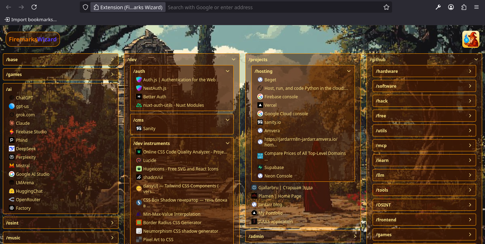
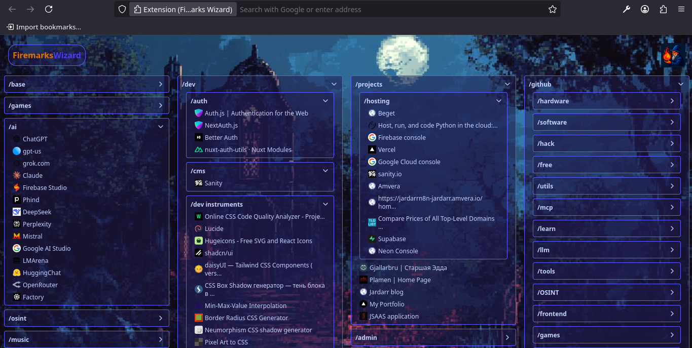

# Firemarks Wizard

**Firemarks Wizard** — это расширение для Firefox, превращающее ваши обычные закладки в волшебные — firemarks, которыми управляет мудрый волшебник! Управляйте своими закладками легко и красиво: сортируйте, перемещайте и наводите порядок в своем браузерном мире с помощью магии.

---

## ✨ Особенности

- **Волшебные firemarks**  
  Каждая закладка — это магический шар, который можно перемещать, группировать и сортировать.

- **Древовидная структура**  
  Все firemarks организованы в древовидную структуру, как в настоящей библиотеке волшебника.

- **Drag'n'drop магия**  
  Просто перетаскивайте firemarks мышью — и они послушно следуют вашему волшебству.

- **Синхронизация с Firefox**  
  Firemarks Wizard использует магию WebExtension API для работы с настоящими закладками вашего браузера.

- **Режим алхимика (разработчика)**  
  Для тестирования и экспериментов можно использовать локальный файл с закладками.

- **Темная и светлая магия**  
  Переключайте тему одним кликом — светлый день или таинственная ночь в вашей библиотеке.

- **Защита от магических сбоев**  
  Встроенный Error Boundary не даст вашему волшебству прерваться из-за ошибок.

---

## 📸 Скриншоты

> 
>
> 

---

## 🛠️ Установка [https://addons.mozilla.org/addon/firemarks-wizard](https://addons.mozilla.org/addon/firemarks-wizard)

---

## 🧙‍♂️ Структура проекта

```
firemarks-wizard/
├── public/              # Статические файлы, manifest.json, bookmarks.json
├── src/
│   ├── components/      # React-компоненты интерфейса (магические элементы)
│   ├── hooks/           # Пользовательские хуки (магические заклинания)
│   ├── types/           # Типы TypeScript для firemarks и WebExtension API
│   ├── App.tsx          # Корневой компонент — волшебная сцена
│   └── main.tsx         # Точка входа — начало магии
├── plugins/             # Vite-плагины
├── vite.config.ts       # Конфигурация Vite
├── tailwind.config.js   # Конфигурация TailwindCSS
└── ...                  # Прочие конфиги и документация
```

---

## ⚙️ Технологии

- **React** + **TypeScript**
- **Vite** (быстрая сборка)
- **TailwindCSS** (стилизация)
- **WebExtension API** (интеграция с Firefox)
- **react-sortablejs** (магия drag'n'drop)

---

## 📄 Лицензия

MIT

---

## 🤝 Вклад

Любой волшебник или ведьма может внести свой вклад!  
Открывайте issues для багов и новых заклинаний.

---

## 🌟 Спасибо

> _Firemarks Wizard — наведите магический порядок в своих закладках!_

---